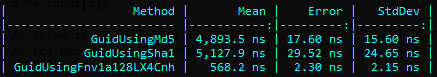

# [Huid](https://github.com/3F/Huid)

A high-speed [FNV-1a-128](https://github.com/3F/sandbox/tree/ff293eb3ecc6b590f7d563b6febf5e7df5f3b75f/csharp/FNV-1a) (\<-[LX4Cnh](https://github.com/3F/sandbox/tree/ff293eb3ecc6b590f7d563b6febf5e7df5f3b75f/algorithms/LodgeX4CorrNoHigh)) hash-based UUID implementation.

```csharp
Huid.NewGuid
(
    "LodgeX4CorrNoHigh (LX4Cnh) algorithm of the high-speed multiplications of 128-bit numbers"
)
```




*(1 ns = 0.000000001 sec)*

**\+** ✔ Compatible with .NET [System.Guid](https://docs.microsoft.com/en-us/dotnet/api/system.guid).

**\+** ✔ Free and Open. MIT License. *Fork! Star! Contribute! Share! Enjoy!*

```r
Copyright (c) 2021  Denis Kuzmin <x-3F@outlook.com> github/3F
```

[ [ ☕ ](https://3F.github.io/Donation/) ]


##  .

🗞 https://twitter.com/github3F/status/1416518052770992132